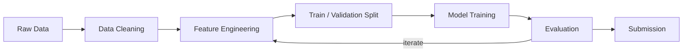

# Kaggle Project: NLP Getting Started — Disaster Tweets

> **Competition:** [Natural Language Processing with Disaster Tweets](https://www.kaggle.com/competitions/nlp-getting-started)
> **Goal:** Predict whether a tweet is about a real disaster (1) or not (0).
> **Metric:** F1 score
> **Best score:** LB F1 = **0.8039** (submission #3)

## Results

| # | Model | Features | CV F1 | LB F1 |
|---|---|---|---|---|
| 1 | LogisticRegression (C=1.0) | Word TF-IDF (5000) + keywords + text_len, word_count | 0.7477 | 0.7941 |
| 2 | LogReg (C=1, balanced) | Same as #1 | 0.7567 | 0.7873 |
| **3** | **LogReg (C=1, balanced)** | **Word TF-IDF (5000) + Char TF-IDF (3000) + keywords + mention/hashtag counts** | **0.7677** | **0.8039** |
| 4 | LogReg + SelectKBest(k=3000) | Best 3000 of 8226 features | 0.7710 | 0.8002 |

Key findings: feature enrichment (char n-grams, structural counts) was the only lever that improved the LB score. HP tuning, model changes (XGBoost/LightGBM), and feature selection did not help.

## Pipeline



## Quick Start

```bash
# 1. Clone this repo
gh repo clone benoit-bremaud/kaggle-nlp-getting-started

# 2. Setup environment
make setup

# 3. Download competition data (accept rules on Kaggle first)
make data COMPETITION=nlp-getting-started

# 4. Start working
make notebook
```

## Project Structure

```
.
├── data/
│   ├── raw/              # Original competition data (gitignored)
│   └── processed/        # Cleaned/transformed data (gitignored)
├── notebooks/
│   └── notebook.ipynb    # Main analysis notebook
├── src/
│   ├── __init__.py
│   ├── text.py           # Text preprocessing (cleaning, mention/hashtag counts)
│   ├── features.py       # Feature engineering (TF-IDF, char n-grams, keywords, numeric)
│   └── utils.py          # General utilities
├── tests/
│   ├── test_text.py      # Tests for text preprocessing (8 tests)
│   └── test_features.py  # Tests for feature engineering (9 tests)
├── outputs/
│   ├── models/           # Saved models (gitignored)
│   └── submissions/      # Submission CSVs + score log
├── PROJECT_LOG.md        # Chronological project activity log (ADR-029)
├── DECISIONS.md          # Project-specific architectural decisions
├── CONTRIBUTING.md       # Conventions for contributing
├── Makefile              # Automation commands
├── setup.sh              # Environment setup script (called by make setup)
├── requirements.txt      # Python dependencies
└── pyproject.toml        # Project config + ruff settings
```

## Available Commands

| Command | Description |
|---|---|
| `make setup` | Install dependencies, configure hooks |
| `make notebook` | Launch Jupyter Lab |
| `make lint` | Check code quality with ruff |
| `make format` | Auto-format code with ruff |
| `make clean` | Remove temporary files |
| `make data COMPETITION=nlp-getting-started` | Download competition data via Kaggle API |
| `make submit COMPETITION=nlp-getting-started FILE=path` | Submit predictions via Kaggle API |

## Workflow

Each experiment follows: branch → code → lint → test → Restart & Run All → commit → PR → CI green → merge → post-merge cleanup → update PROJECT_LOG.md.

The full workflow and global decisions are defined in the parent directory (`~/Documents/07_kaggle/`): `WORKFLOW.md` and `DECISIONS.md` (ADR-001 to ADR-029).

## Documentation

| File | Purpose |
|---|---|
| [PROJECT_LOG.md](PROJECT_LOG.md) | Chronological activity log (PRs, submissions, decisions) |
| [DECISIONS.md](DECISIONS.md) | Project-specific architectural decisions |
| [CONTRIBUTING.md](CONTRIBUTING.md) | Git conventions, code quality, submission workflow |

## License

[MIT](LICENSE)
